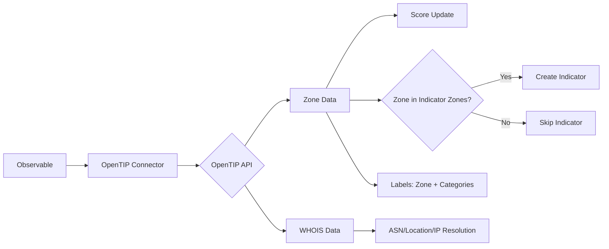

# OpenCTI Kaspersky OpenTIP Connector

| Status | Date | Comment |
|--------|------|---------|
| Filigran Verified | - | - |

## Table of Contents

- [Introduction](#introduction)
- [Installation](#installation)
  - [Requirements](#requirements)
- [Configuration](#configuration)
  - [OpenCTI Configuration](#opencti-configuration)
  - [Base Connector Configuration](#base-connector-configuration)
  - [OpenTIP Configuration](#opentip-configuration)
- [Deployment](#deployment)
  - [Docker Deployment](#docker-deployment)
  - [Manual Deployment](#manual-deployment)
- [Usage](#usage)
- [Behavior](#behavior)
  - [Data Flow](#data-flow)
  - [Enrichment Mapping](#enrichment-mapping)
  - [Indicator Creation](#indicator-creation)
  - [Generated STIX Objects](#generated-stix-objects)
- [Debugging](#debugging)
- [Additional Information](#additional-information)

---

## Introduction

Kaspersky OpenTIP is a threat intelligence platform providing reputation data for files, URLs, domains, and IPs. This connector enriches observables by querying the Kaspersky OpenTIP API and importing threat intelligence.

Key features:
- Zone-based reputation (Red, Orange, Yellow, Green, Grey)
- Score mapping: Red=90, Orange=80, Yellow=40, Green=10
- Category labeling (category + zone combinations)
- ASN and location relationships for IPs
- IP resolution for domains
- Unified indicator zones configuration

---

## Installation

### Requirements

- OpenCTI Platform >= 6.0.6
- Kaspersky OpenTIP API key
- Network access to Kaspersky OpenTIP API (https://opentip.kaspersky.com)

---

## Configuration

### OpenCTI Configuration

| Parameter | Docker envvar | Mandatory | Description |
|-----------|---------------|-----------|-------------|
| `opencti_url` | `OPENCTI_URL` | Yes | The URL of the OpenCTI platform |
| `opencti_token` | `OPENCTI_TOKEN` | Yes | The default admin token configured in the OpenCTI platform |

### Base Connector Configuration

| Parameter | Docker envvar | Mandatory | Description |
|-----------|---------------|-----------|-------------|
| `connector_id` | `CONNECTOR_ID` | No | A valid arbitrary `UUIDv4` unique for this connector |
| `connector_name` | `CONNECTOR_NAME` | No | The name of the connector instance |
| `connector_scope` | `CONNECTOR_SCOPE` | No | Supported: `StixFile`, `Artifact`, `IPv4-Addr`, `Domain-Name`, `Url`, `Hostname` |
| `connector_auto` | `CONNECTOR_AUTO` | No | Enable/disable auto-enrichment |
| `connector_log_level` | `CONNECTOR_LOG_LEVEL` | No | Log level (`debug`, `info`, `warn`, `error`) |

### OpenTIP Configuration

| Parameter | Docker envvar | Mandatory | Description |
|-----------|---------------|-----------|-------------|
| `opentip_token` | `OPENTIP_TOKEN` | Yes | Kaspersky OpenTIP API key |
| `opentip_max_tlp` | `OPENTIP_MAX_TLP` | No | Maximum TLP for processing (default: TLP:AMBER) |
| `opentip_replace_with_lower_score` | `OPENTIP_REPLACE_WITH_LOWER_SCORE` | No | Replace score even if lower (default: false) |
| `opentip_zone_score_red` | `OPENTIP_ZONE_SCORE_RED` | No | Score for Red zone (default: 90) |
| `opentip_zone_score_orange` | `OPENTIP_ZONE_SCORE_ORANGE` | No | Score for Orange zone (default: 80) |
| `opentip_zone_score_yellow` | `OPENTIP_ZONE_SCORE_YELLOW` | No | Score for Yellow zone (default: 40) |
| `opentip_zone_score_green` | `OPENTIP_ZONE_SCORE_GREEN` | No | Score for Green zone (default: 10) |
| `opentip_file_create_note_full_report` | `OPENTIP_FILE_CREATE_NOTE_FULL_REPORT` | No | Include full report as Note (default: true) |
| `opentip_file_upload_unseen_artifacts` | `OPENTIP_FILE_UPLOAD_UNSEEN_ARTIFACTS` | No | Upload unseen artifacts (default: false) |
| `opentip_ip_add_relationships` | `OPENTIP_IP_ADD_RELATIONSHIPS` | No | Add ASN and location relationships (default: false) |
| `opentip_domain_add_relationships` | `OPENTIP_DOMAIN_ADD_RELATIONSHIPS` | No | Add IP resolution relationships (default: false) |
| `opentip_url_upload_unseen` | `OPENTIP_URL_UPLOAD_UNSEEN` | No | Upload unseen URLs (default: false) |
| `opentip_include_attributes_in_note` | `OPENTIP_INCLUDE_ATTRIBUTES_IN_NOTE` | No | Include attributes in Note (default: false) |
| `opentip_add_categories_labels` | `OPENTIP_ADD_CATEGORIES_LABELS` | No | Add category labels (default: true) |
| `opentip_add_zone_labels` | `OPENTIP_ADD_ZONE_LABELS` | No | Add zone labels (default: true) |
| `opentip_indicator_zones` | `OPENTIP_INDICATOR_ZONES` | No | Zones triggering indicators (default: Red,Orange,Yellow) |

---

## Deployment

### Docker Deployment

Build a Docker Image using the provided `Dockerfile`.

Example `docker-compose.yml`:

```yaml
version: '3'
services:
  connector-opentip:
    image: opencti/connector-opentip:latest
    environment:
      - OPENCTI_URL=http://localhost
      - OPENCTI_TOKEN=ChangeMe
      - OPENTIP_TOKEN=ChangeMe
      - OPENTIP_MAX_TLP=TLP:AMBER
      - OPENTIP_REPLACE_WITH_LOWER_SCORE=false
      - OPENTIP_ZONE_SCORE_RED=90
      - OPENTIP_ZONE_SCORE_ORANGE=80
      - OPENTIP_ZONE_SCORE_YELLOW=40
      - OPENTIP_ZONE_SCORE_GREEN=10
      - OPENTIP_FILE_CREATE_NOTE_FULL_REPORT=true
      - OPENTIP_FILE_UPLOAD_UNSEEN_ARTIFACTS=false
      - OPENTIP_IP_ADD_RELATIONSHIPS=false
      - OPENTIP_DOMAIN_ADD_RELATIONSHIPS=false
      - OPENTIP_URL_UPLOAD_UNSEEN=false
      - OPENTIP_INCLUDE_ATTRIBUTES_IN_NOTE=false
      - OPENTIP_ADD_CATEGORIES_LABELS=true
      - OPENTIP_ADD_ZONE_LABELS=true
      - OPENTIP_INDICATOR_ZONES=Red,Orange,Yellow
    restart: always
```

### Manual Deployment

1. Clone the repository
2. Copy `config.yml.sample` to `config.yml` and configure
3. Install dependencies: `pip install -r requirements.txt`
4. Run the connector

---

## Usage

The connector enriches observables by:
1. Querying the OpenTIP API for zone and reputation data
2. Setting scores based on zone (Red=90, Orange=80, Yellow=40, Green=10)
3. Creating labels with zone and category information
4. Creating indicators based on indicator zones configuration
5. Adding ASN and location relationships for IPs (optional)
6. Adding IP resolution relationships for domains (optional)

Trigger enrichment:
- Manually via the OpenCTI UI
- Automatically if `CONNECTOR_AUTO=true`
- Via playbooks

---

## Behavior

### Data Flow



### Enrichment Mapping

| Observable Type | Enrichment Data | Relationships |
|-----------------|-----------------|---------------|
| StixFile/Artifact | Zone, FileStatus, Categories | Indicator based-on |
| IPv4-Addr | Zone, Categories, WHOIS | ASN, Location |
| Domain-Name | Zone, DomainStatus, Categories | Resolved IPs |
| URL | Zone, Categories | Indicator based-on |
| Hostname | Zone, Categories | Similar to domain |

### Indicator Creation

Indicators are created when an observable's zone is in the configured `indicator_zones` list. By default, indicators are created for Red, Orange, and Yellow zones.

### Generated STIX Objects

| Object Type | Description |
|-------------|-------------|
| Note | Full analysis results table |
| Indicator | Created when zone is in indicator zones |
| Autonomous System | ASN for IP addresses |
| Location | Geolocation for IPs |
| Relationship | ASN, location, IP resolution |

---

## Labels

Zone labels (e.g., `opentip/red`, `opentip/orange`, `opentip/yellow`, `opentip/green`):
- Applied based on the primary zone from API response
- Controlled by `opentip_add_zone_labels` (default: true)

Category labels:
- Category name labels (e.g., `opentip/category_malware`)
- Combined category+zone labels (e.g., `opentip/category_malware_red`)
- Only the highest-zone category is added
- Controlled by `opentip_add_categories_labels` (default: true)

---

## Debugging

Enable debug logging by setting `CONNECTOR_LOG_LEVEL=debug`.

Use logging with:
```python
self.helper.log_{LOG_LEVEL}("Message")
```

---

## Additional Information

- [Kaspersky OpenTIP](https://opentip.kaspersky.com/)
- [OpenTIP API Documentation](https://opentip.kaspersky.com/Help/Doc_data/)
- [API Playground](https://opentip.kaspersky.com/api)

---

## Zone Description

| Zone | Score | Description |
|------|-------|-------------|
| Red | 90 | The object can be classified as Malware |
| Orange | 80 | The object can be classified as Not trusted and may host malicious objects |
| Yellow | 40 | The object is classified as Adware and other (Adware, Pornware, etc.) |
| Green | 10 | The object has the Clean or No threats detected status |
| Grey | N/A | No data or not enough information is available |
